# Dream House - React Project

## Project Overview

Dream House is a real estate website that allows users to explore various residential properties including single-family homes, townhouses, apartments, student housing, senior living communities, and vacation rentals. The website offers a fully functional authentication system powered by Firebase, enabling users to register, log in, view property details, bookmark their favorite listings, update and view their profiles.

#### Live Preview: [Click here](https://dream-house-cbf6d.web.app/)

## Installed Packages

- React v18.2.0
- React DOM v18.2.0
- React Hook Form v7.51.2
- AOS v2.3.4
- Swiper v11.1.0
- React Router DOM v6.22.3
- Firebase v10.10.0
- React Icons v5.0.1
- React Helmet Async v2.0.4
- React Toastify v10.0.5
- Sort-By v1.2.0
- Match-Sorter v6.3.4
- LocalForage v1.10.0

## Pages

- **Home**: Landing page displaying a beautiful animated slider, featured properties, clients review and FAQ.
- **Profile**: User profile page to view user name, email and profile image.
- **Update Profile**: update profile information: name and profile picture.
- **Bookmarks**: View bookmarked properties.
- **Contact Us**: Static page displaying contact information and a form.

## Functionalities

- **Authentication**: Users can sign up, log in, and log out securely using Firebase authentication. Additionally supports google and github login
- **Form Validation**: Basic form validation handled using react hook form
- **Property Listings**: Browse various types of residential properties with detailed information.
- **Bookmarking**: Save favorite listings for later viewing.
- **Profile Management**: Users can update their profile information and profile picture.

## Screenshots

  
Home Page - Slider 

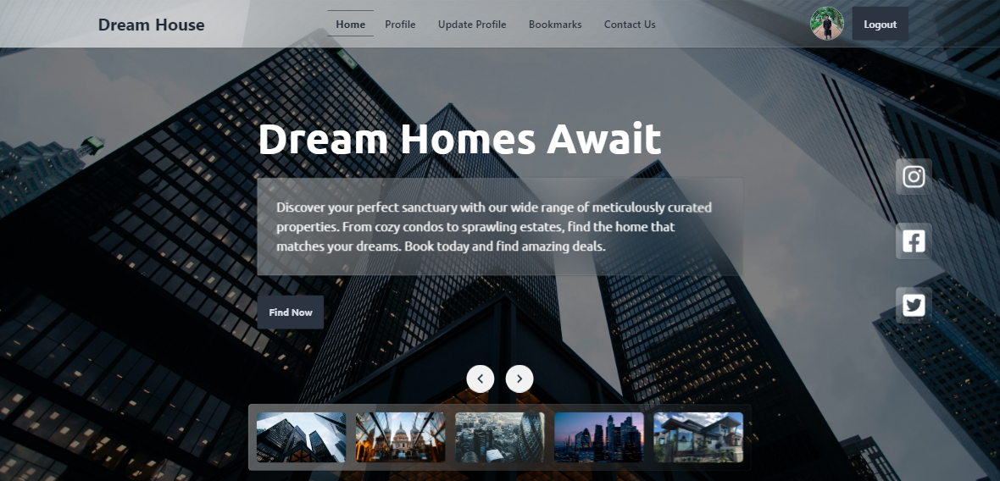

  
Home Page - Estates 

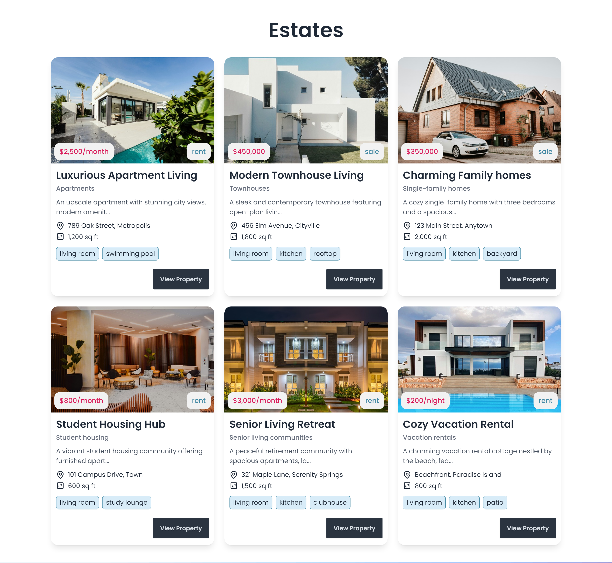

  
Home Page - Clients Review 

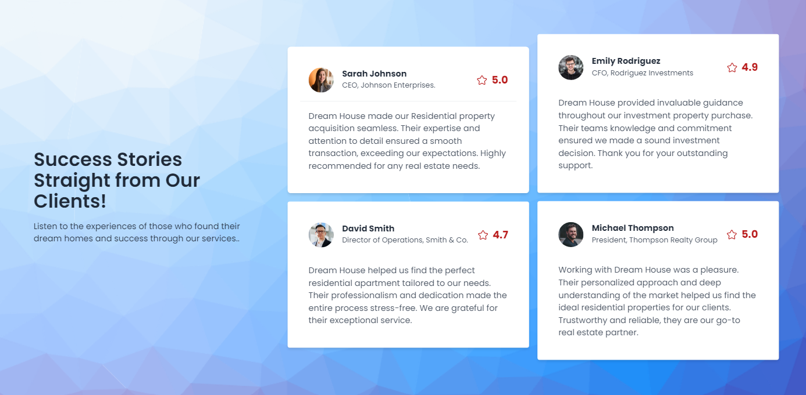

  
Home Page - FAQ 

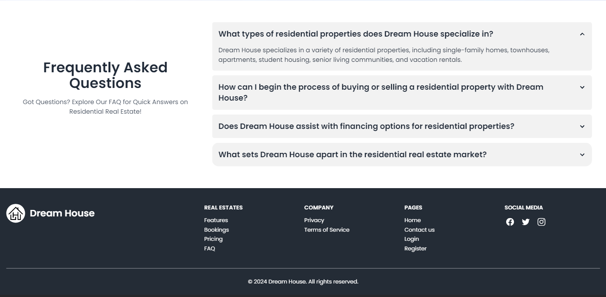

  
Property Details

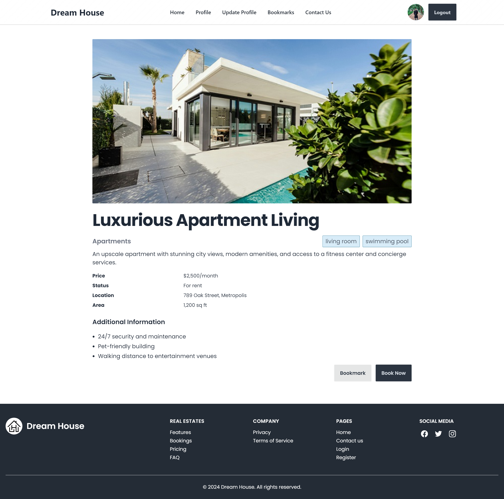

  
Bookmarks Page

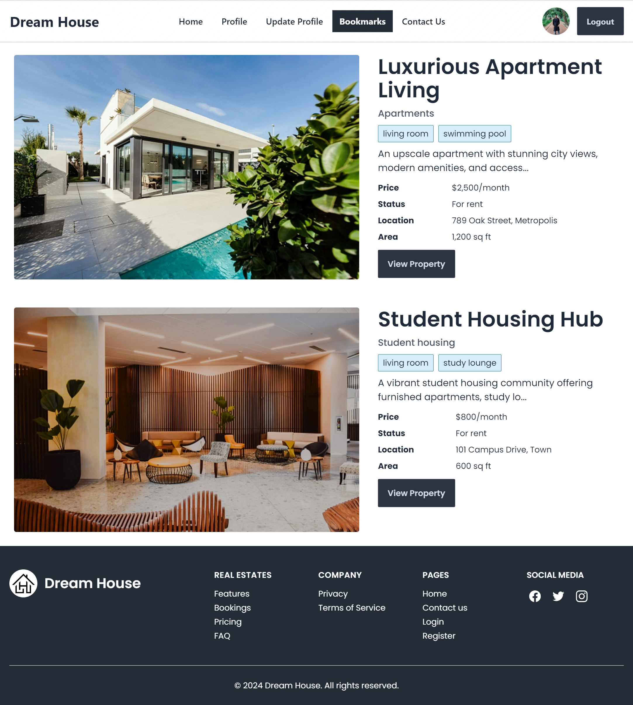

  
Profile Page

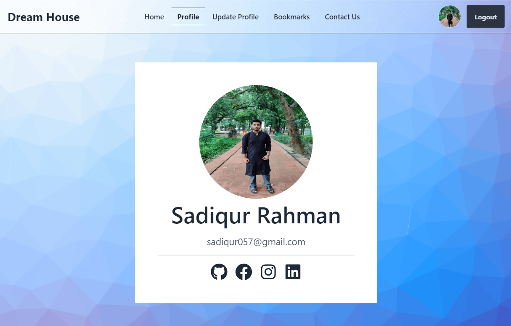

  
Update Profile Page

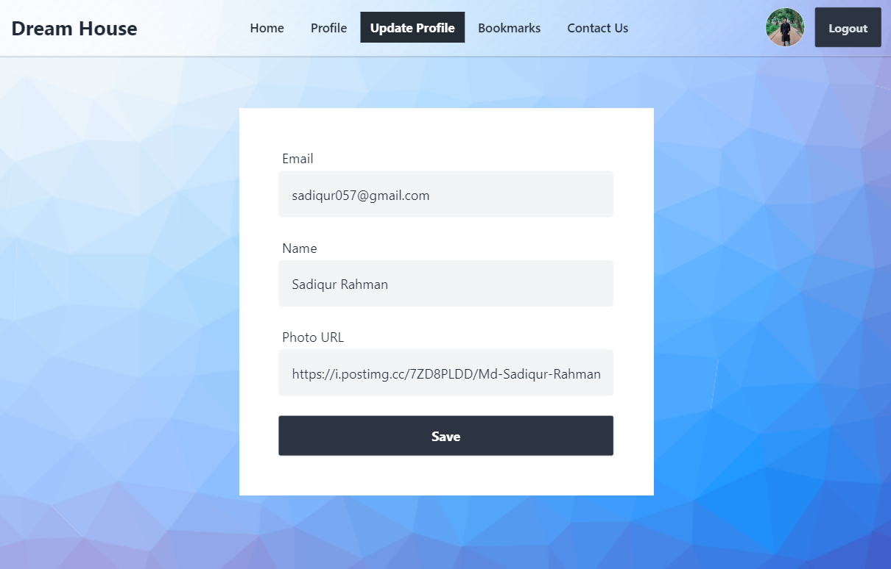

  
Contact us Page

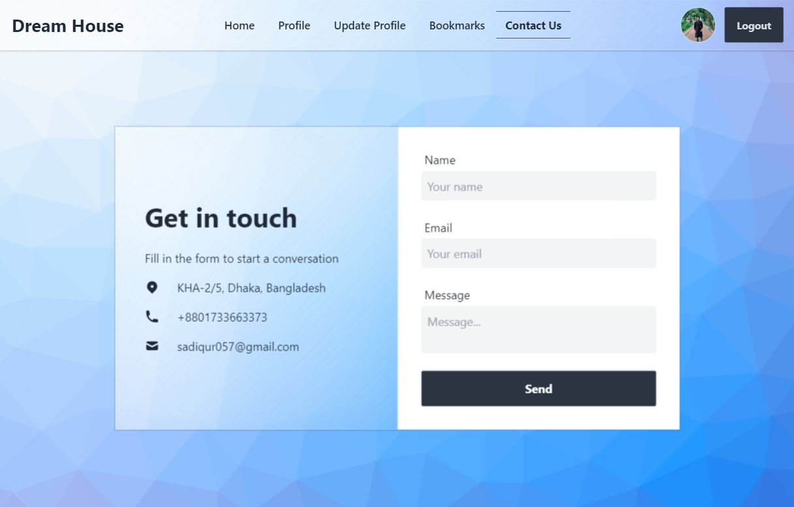

  
Login Page

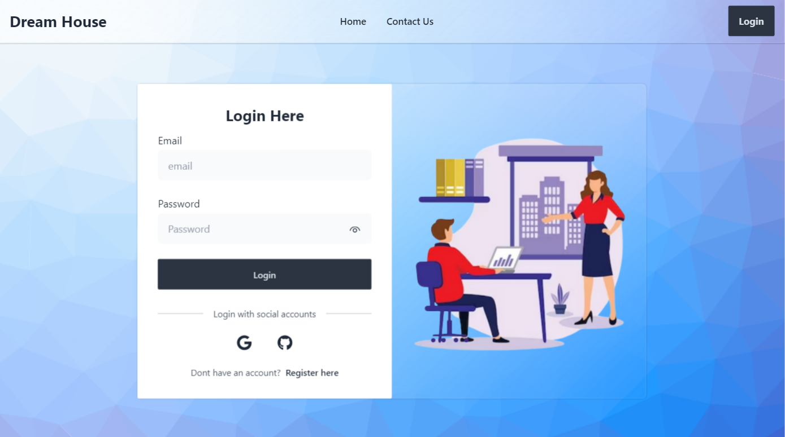

  
Register Page

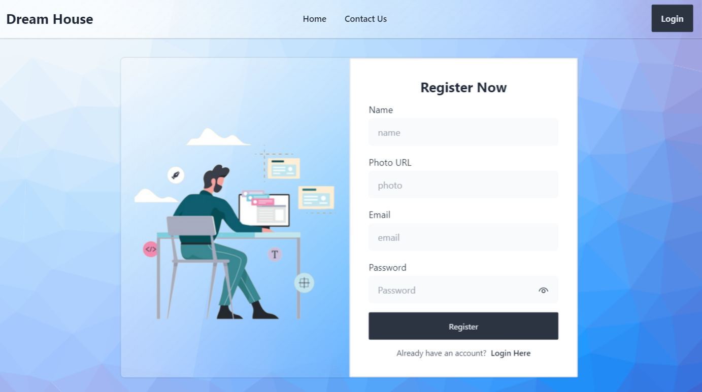

